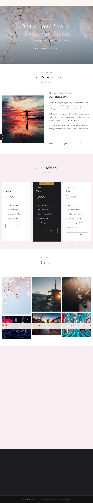

# Eternal Moments — Bridal Photography Booking


## About the Project

**Eternal Moments** is a single-page static website for a bridal photography studio. Designed for photographers who want an elegant online presence without the overhead of a framework or backend, the entire site ships as a single `index.html` file with all HTML, CSS, and JavaScript inline.

**Key features:**
- Responsive blush-pink & gold palette, mobile-friendly at 768 px breakpoint
- Hero, About, Packages, Gallery, Booking, and Contact sections
- Contact/booking form powered by [formsubmit.co](https://formsubmit.co) — no backend or API keys required
- Smooth-scroll navigation
- Zero build step, zero dependencies

## Screenshot



> Live at **https://teva969.github.io/bride-booking/**

## File Structure

```
bride-booking/
├── index.html          # Entire site — HTML, CSS, and JS in one file
├── README.md
├── CLAUDE.md           # Claude Code project instructions
├── .github/
│   └── workflows/
│       └── deploy.yml  # GitHub Actions → GitHub Pages deployment
└── .claude/
    └── commands/
        └── github-push.md
```

## How to Use

### Run locally

```bash
git clone https://github.com/teva969/bride-booking.git
cd bride-booking
python3 -m http.server 8080
# open http://localhost:8080
```

> **Note:** the booking form uses `fetch()` to POST to formsubmit.co, so the site must be served over HTTP — opening `index.html` directly as a `file://` URL will be blocked by CORS.

### Customise images

All photos are Unsplash URLs with `?w=&h=&fit=crop` query params. Swap any URL in `index.html` to change a photo.

### Customise colours

Edit the CSS custom properties at the top of the `<style>` block:

```css
--blush: #f9e8e8;
--rose: #d4a0a0;
--dark-rose: #b07070;
--gold: #c9a84c;
--cream: #fdf6f0;
```

### Update the booking form recipient

Change `qingru@gmail.com` in the `<script>` block to your own address. formsubmit.co will send an activation email on the first submission — click the link in that email before real bookings are delivered.

## Form Submission

- Service: [formsubmit.co](https://formsubmit.co) AJAX endpoint (free, no account required)
- Submissions arrive as emails to the address in the fetch URL
- First submission triggers an activation email — that link must be clicked once

## Live Site

**https://teva969.github.io/bride-booking/**
